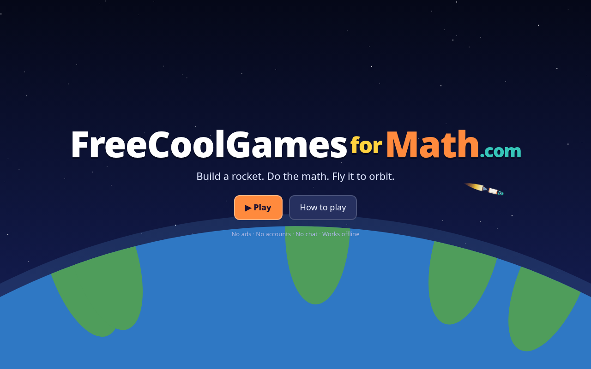
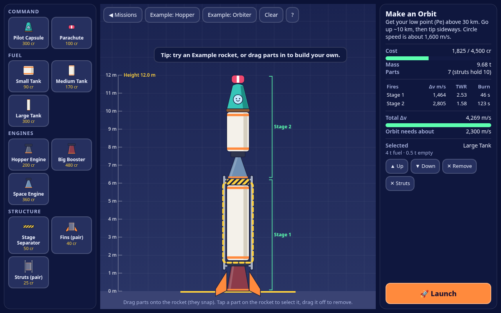
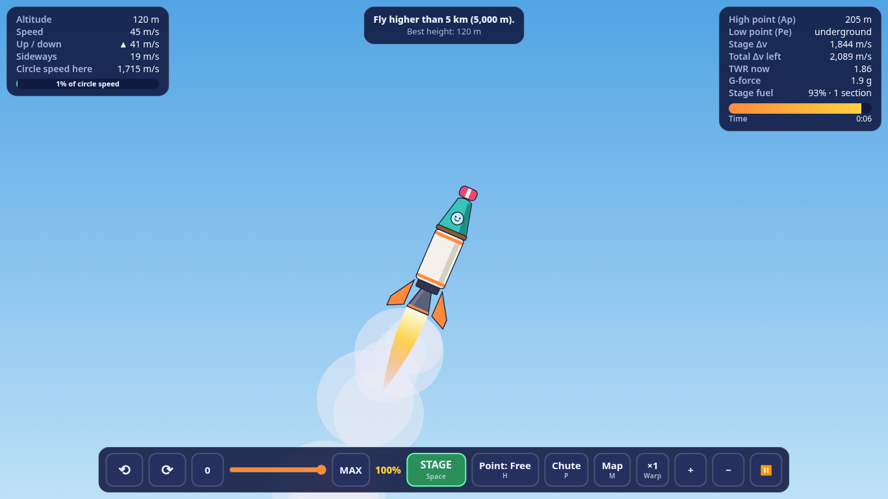

# FreeCoolGamesforMath.com · Rocket Builder

Build a rocket from parts, launch it, and do the math to reach orbit.
A free, school-safe browser game made for Chromebooks: **no ads, no accounts, no chat, no tracking**.
Progress and rocket designs are saved only in the browser (`localStorage`).

**Play:** https://kampfguy.github.io/FreeCoolGamesforMath/ (https://FreeCoolGamesforMath.com once the domain is registered and DNS is set up, see below)

## What's in it
- **Hangar:** snap-build from 11 original parts (capsule, parachute, 3 tanks, 3 engines, stage separator, fins, struts). Drag and drop or tap to add.
  Live math panel: cost vs budget, mass, per-stage **Δv**, **TWR**, burn time, total Δv vs. the ~2,300 m/s needed for orbit, wobble/strut check.
- **Flight:** launch pad, throttle, steering, staging (dropped stages fall away), fuel burn, drag, parachutes, crash or soft landing,
  2D orbital physics around the small planet *Numeria*. Map view shows your path with **Ap/Pe** (high and low points).
  The HUD compares your *sideways speed* to the *circle speed* √(μ/r) needed to stay in orbit.
- **Missions:** First Hop (5 km), Edge of Space (30 km), Make an Orbit, Round Trip (space + soft landing), Free Flight. Up to 3 stars each (goal, under budget, bonus).

## Controls (keyboard + trackpad)
| Action | Keys / mouse |
|---|---|
| Start engines / drop stage | **Space** or STAGE button |
| Throttle | **W/S** or **↑/↓**, **Z** = max, **X** = zero, or the slider |
| Turn | **A/D** or **←/→**, the ⟲ ⟳ buttons, or hold the mouse/trackpad where you want to point |
| Auto-point (Free / Up / Forward / Back) | **H** |
| Parachute | **P** |
| Map | **M** |
| Time warp | **,** and **.** |
| Zoom | two-finger scroll, **+ / −** |
| Pause | **Esc** |

## Tech
Plain HTML/CSS/JavaScript (ES modules) with a 2D canvas. No frameworks, no build step, no WebGL/WebGPU needed.
Pixel ratio is capped at 1.5 so low-end Chromebooks stay near 60 fps. A service worker (`sw.js`) caches the game for offline play after the first visit.
All art is original, drawn with simple canvas shapes.

Run locally: `python3 -m http.server` in this folder, then open http://localhost:8000.

## Custom domain: FreeCoolGamesforMath.com
**Status (2026-10-08):** `freecoolgamesformath.com` does not resolve (NXDOMAIN; it looks unregistered), so DNS is **not** set up yet.

Why the `CNAME` file is on a branch: with "Deploy from branch", a `CNAME` file in `main` makes GitHub redirect
`kampfguy.github.io/FreeCoolGamesforMath` to the custom domain, which would break the game while the domain doesn't exist.
So the `CNAME` file (`FreeCoolGamesforMath.com`) is ready on the **`custom-domain`** branch.

When you're ready:
1. **Register** `freecoolgamesformath.com` at any registrar.
2. In the registrar's DNS settings add:
   - Apex `@` **A** records → `185.199.108.153`, `185.199.109.153`, `185.199.110.153`, `185.199.111.153`
   - (optional) Apex `@` **AAAA** → `2606:50c0:8000::153`, `2606:50c0:8001::153`, `2606:50c0:8002::153`, `2606:50c0:8003::153`
   - Or, if your DNS host supports **ALIAS / ANAME / CNAME-flattening** at the apex: `@` → `kampfguy.github.io`
   - `www` **CNAME** → `kampfguy.github.io`
3. Turn the domain on (either way works):
   - `git fetch && git checkout main && git merge origin/custom-domain && git push`, **or**
   - GitHub repo **Settings → Pages → Custom domain** → `FreeCoolGamesforMath.com` → Save.
4. Once the DNS check passes, tick **Enforce HTTPS**. Optional: add the domain under your GitHub account's **Settings → Pages → Verified domains**.

## License
MIT © 2026 Kampf Kaiser
